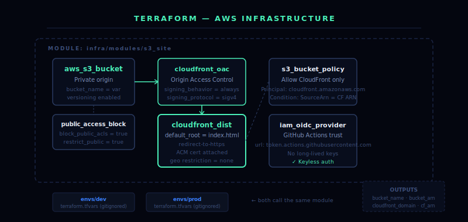

# Infrastructure

Terraform-managed AWS infrastructure for [doraejangue.com](https://doraejangue.com).

---

## Architecture



```
User → Route 53 (A alias) → CloudFront → S3 (private, OAC)
                                       ↑
                               ACM certificate (us-east-1)
```

## What Terraform provisions

| Resource | Purpose |
|---|---|
| `aws_s3_bucket` | Private origin bucket for static files |
| `aws_s3_bucket_public_access_block` | Block all public S3 access |
| `aws_cloudfront_origin_access_control` | OAC for SigV4-signed CF→S3 requests |
| `aws_cloudfront_distribution` | CDN, HTTPS, edge delivery |
| `aws_s3_bucket_policy` | Allow only CloudFront to read from S3 |
| `aws_acm_certificate` | TLS cert (must be in us-east-1 for CloudFront) |
| `aws_route53_record` | A alias record pointing domain → CloudFront |

## Structure

```
infra/
├── modules/
│   └── s3_site/
│       ├── main.tf         # S3 + OAC + CloudFront + bucket policy
│       ├── variables.tf    # Input variables
│       └── outputs.tf      # Bucket name, CF domain, CF ARN
└── envs/
    ├── dev/
    │   ├── main.tf         # Dev environment wiring
    │   ├── variables.tf
    │   └── terraform.tfvars  # ← gitignored, never committed
    └── prod/
        ├── main.tf         # Prod environment wiring
        └── variables.tf
```

## Usage

```bash
# From the environment folder
cd infra/envs/dev

terraform init
terraform validate
terraform plan -var-file="terraform.tfvars"
terraform apply
```

## Security

- S3 public access is fully blocked at bucket level
- Only CloudFront can read from S3 via OAC + bucket policy
- `terraform.tfvars` and `*.tfstate` are gitignored — never committed
- IAM OIDC is used for GitHub Actions deployments — no stored AWS credentials

## Outputs

After `terraform apply`:

| Output | Description |
|---|---|
| `bucket_name` | S3 bucket name |
| `bucket_arn` | S3 bucket ARN |
| `cloudfront_domain_name` | e.g. `d123example.cloudfront.net` |
| `cloudfront_distribution_arn` | Full CloudFront ARN |
